# 📚 BÁO CÁO ĐỒ ÁN: IELTS WRITEBETTER

---

## 📋 Mục Lục

1. [Giới Thiệu Ứng Dụng](#1-giới-thiệu-ứng-dụng)
2. [Mục Đích Xã Hội](#2-mục-đích-xã-hội)
3. [Công Nghệ Sử Dụng](#3-công-nghệ-sử-dụng)
4. [Sơ Đồ Quy Trình](#4-sơ-đồ-quy-trình)
5. [Sơ Đồ UML](#5-sơ-đồ-uml)
6. [Giao Diện Ứng Dụng](#6-giao-diện-ứng-dụng)
7. [Cấu Trúc Dự Án](#7-cấu-trúc-dự-án)
8. [Chi Tiết Các File và Chức Năng](#8-chi-tiết-các-file-và-chức-năng)
9. [Các Trang Frontend](#9-các-trang-frontend)
10. [Backend API và Tính Năng](#10-backend-api-và-tính-năng)
11. [Các Widget và Category](#11-các-widget-và-category)
12. [UI Components](#12-ui-components)
13. [Hệ Thống Authentication](#13-hệ-thống-authentication)
14. [Tổng Kết](#14-tổng-kết)
15. [Đề Xuất Cải Thiện](#15-đề-xuất-cải-thiện)

---

## 1. Giới Thiệu Ứng Dụng

### 🎯 Tên ứng dụng: **IELTS WriteBetter**

**IELTS WriteBetter** là một ứng dụng web hỗ trợ luyện viết IELTS được xây dựng bằng công nghệ AI, giúp người học cải thiện kỹ năng viết thông qua phản hồi chi tiết dựa trên các tiêu chí chấm điểm chính thức của IELTS:

- **TR (Task Response)**: Đáp ứng yêu cầu đề bài
- **CC (Coherence & Cohesion)**: Mạch lạc và liên kết
- **LR (Lexical Resource)**: Vốn từ vựng
- **GRA (Grammar & Accuracy)**: Ngữ pháp và độ chính xác

---

## 2. Mục Đích Xã Hội

### 🌍 Đóng Góp Cho Xã Hội

| Mục Đích | Mô Tả |
|----------|-------|
| **Giáo dục toàn diện** | Hỗ trợ học sinh, sinh viên và người đi làm chuẩn bị thi IELTS với chi phí thấp |
| **Tiếp cận công nghệ AI** | Đem công nghệ AI tiên tiến đến gần hơn với người học |
| **Học tập cá nhân hóa** | Cung cấp phản hồi cá nhân hóa dựa trên điểm mạnh/yếu của từng người |
| **Theo dõi tiến độ** | Giúp người học thấy được sự tiến bộ qua thời gian |
| **Tiết kiệm thời gian** | Thay thế việc chờ đợi giáo viên chấm bài |
| **Hỗ trợ tự học** | Người học có thể luyện tập mọi lúc, mọi nơi |

### 👥 Đối Tượng Sử Dụng

- Học sinh cấp 3 chuẩn bị du học
- Sinh viên đại học cần chứng chỉ IELTS
- Người đi làm cần nâng cao điểm IELTS
- Giáo viên cần công cụ hỗ trợ chấm bài

---

## 3. Công Nghệ Sử Dụng

### 🛠️ Stack Công Nghệ

#### Frontend
| Công nghệ | Phiên bản | Mô tả |
|-----------|-----------|-------|
| **Next.js** | 15.2.4 | Framework React với App Router |
| **React** | 19 | Thư viện UI |
| **TypeScript** | 5.x | Ngôn ngữ lập trình |
| **Tailwind CSS** | 4.1.9 | Framework CSS utility-first |
| **shadcn/ui** | Latest | Bộ component UI |
| **Recharts** | Latest | Thư viện biểu đồ |
| **Lucide React** | 0.454.0 | Icon library |

#### Backend & Database
| Công nghệ | Mô tả |
|-----------|-------|
| **Firebase** | Backend-as-a-Service |
| **Firebase Auth** | Xác thực người dùng (Email/Password, Google) |
| **Firestore** | Cơ sở dữ liệu NoSQL |
| **Firebase Storage** | Lưu trữ file |

#### AI & Machine Learning
| Công nghệ | Mô tả |
|-----------|-------|
| **Google Gemini AI** | Model AI chính (gemini-2.0-flash) |
| **@ai-sdk/google** | SDK tích hợp Google AI |
| **@google/generative-ai** | Native Gemini client |

#### Thư viện hỗ trợ
| Thư viện | Mục đích |
|----------|----------|
| **react-hook-form** | Quản lý form |
| **zod** | Validation schema |
| **react-markdown** | Render markdown |
| **date-fns** | Xử lý ngày tháng |
| **next-themes** | Dark/Light mode |

### 🖼️ Hình 6: Ngôn ngữ lập trình TypeScript


**TypeScript** là ngôn ngữ lập trình mã nguồn mở được phát triển bởi Microsoft. Nó là superset của JavaScript, bổ sung tính năng static typing giúp phát hiện lỗi sớm trong quá trình phát triển.

| Đặc điểm | Mô tả |
|----------|-------|
| **Static Typing** | Kiểm tra kiểu dữ liệu tại compile time |
| **IDE Support** | Hỗ trợ tốt với VS Code, IntelliJ |
| **Backward Compatible** | Tương thích ngược với JavaScript |
| **Enterprise Ready** | Phù hợp cho dự án lớn |

### 🖼️ Hình 7: Nền tảng Firebase


**Firebase** là nền tảng phát triển ứng dụng của Google, cung cấp các dịch vụ backend-as-a-service (BaaS).

```
┌─────────────────────────────────────────────────────────────────┐
│                        FIREBASE PLATFORM                         │
├─────────────────┬─────────────────┬─────────────────────────────┤
│                 │                 │                             │
│  🔐 Firebase    │  📊 Firestore   │  📁 Firebase Storage       │
│     Auth        │     Database    │                             │
│                 │                 │                             │
│  - Email/Pass   │  - NoSQL DB     │  - File upload             │
│  - Google OAuth │  - Real-time    │  - CDN delivery            │
│  - Session Mgmt │  - Offline sync │  - Security rules          │
│                 │                 │                             │
└─────────────────┴─────────────────┴─────────────────────────────┘
```

### 🖼️ Hình 8: Môi trường phát triển VS Code


**Visual Studio Code** là IDE mã nguồn mở được phát triển bởi Microsoft, hỗ trợ đa nền tảng và có ecosystem extensions phong phú.

| Tính năng | Mô tả |
|-----------|-------|
| **IntelliSense** | Tự động hoàn thành code thông minh |
| **Debugging** | Debug trực tiếp trong IDE |
| **Git Integration** | Tích hợp Git sẵn có |
| **Extensions** | Hàng nghìn extension hỗ trợ |
| **Terminal** | Terminal tích hợp |

### 🖼️ Hình 9: Ngôn ngữ thiết kế hệ thống UML

**UML (Unified Modeling Language)** là ngôn ngữ mô hình hóa tiêu chuẩn trong ngành công nghiệp phần mềm.

```
┌─────────────────────────────────────────────────────────────────┐
│                         UML DIAGRAMS                             │
├───────────────────────────────┬─────────────────────────────────┤
│      STRUCTURAL DIAGRAMS      │      BEHAVIORAL DIAGRAMS        │
├───────────────────────────────┼─────────────────────────────────┤
│  📦 Class Diagram             │  📋 Use Case Diagram            │
│  🔗 Component Diagram         │  🔄 Activity Diagram            │
│  📊 Object Diagram            │  📝 Sequence Diagram            │
│  🏗️ Package Diagram           │  🎭 State Machine Diagram       │
└───────────────────────────────┴─────────────────────────────────┘
```

---

## 4. Sơ Đồ Quy Trình

### 🖼️ Hình 1: Quy trình đăng ký tài khoản (Account Registration Process)

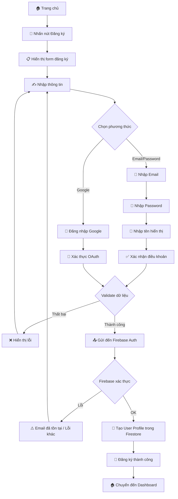

**Mô tả quy trình:**
1. Người dùng truy cập trang đăng ký
2. Chọn phương thức đăng ký (Email/Password hoặc Google)
3. Nhập thông tin cần thiết
4. Hệ thống validate dữ liệu
5. Firebase Auth xác thực và tạo tài khoản
6. Tạo profile người dùng trong Firestore
7. Chuyển hướng đến Dashboard

---

### 🖼️ Hình 2: Quy trình đăng nhập (Login Process)

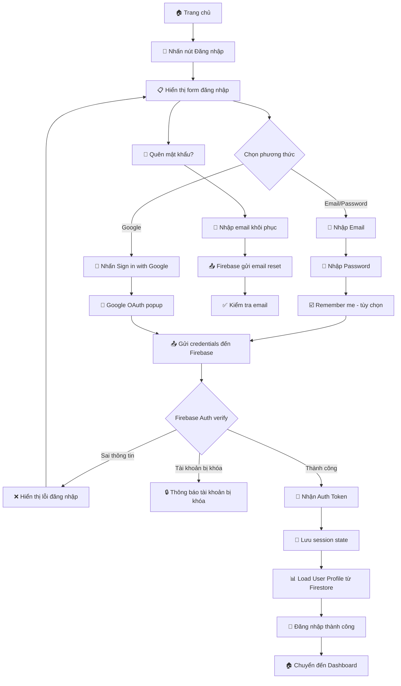

**Mô tả quy trình:**
1. Người dùng truy cập trang đăng nhập
2. Chọn phương thức: Email/Password hoặc Google OAuth
3. Nhập thông tin đăng nhập
4. Firebase Auth xác thực credentials
5. Nếu thành công, lưu session và load profile
6. Chuyển hướng đến Dashboard

---

### 🖼️ Hình 3: Quy trình chấm điểm bài viết (Essay Scoring Process)

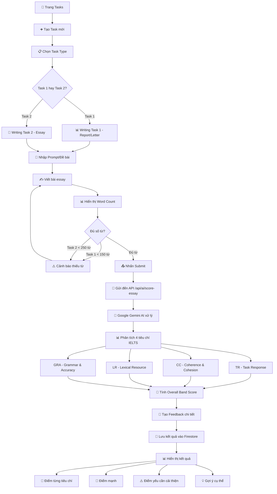

**Mô tả quy trình:**
1. Người dùng tạo task mới, chọn loại (Task 1 hoặc Task 2)
2. Nhập đề bài và viết essay
3. Hệ thống kiểm tra word count
4. Gửi bài viết đến Google Gemini AI
5. AI phân tích theo 4 tiêu chí IELTS (TR, CC, LR, GRA)
6. Tính toán Overall Band Score
7. Tạo feedback chi tiết với điểm mạnh, điểm yếu và gợi ý
8. Lưu kết quả vào Firestore và hiển thị cho người dùng

---

### 🖼️ Hình 4: Quy trình AI Chatbot

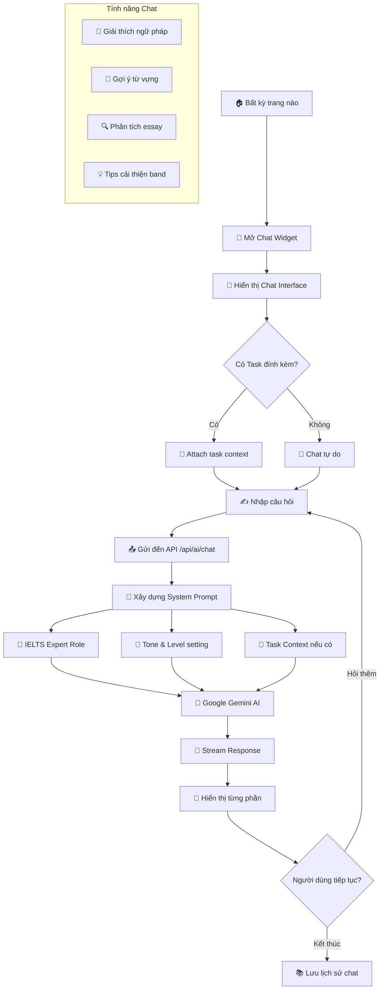

**Mô tả quy trình:**
1. Người dùng mở Chat Widget từ bất kỳ trang nào
2. Có thể đính kèm task hiện tại để hỏi về bài viết cụ thể
3. Nhập câu hỏi về IELTS Writing
4. Hệ thống xây dựng context với system prompt phù hợp
5. Google Gemini AI xử lý và trả lời theo stream
6. Hiển thị câu trả lời real-time
7. Người dùng có thể tiếp tục hội thoại

---

### 🖼️ Hình 5: Quy trình Báo cáo tiến độ (Progress Reports)

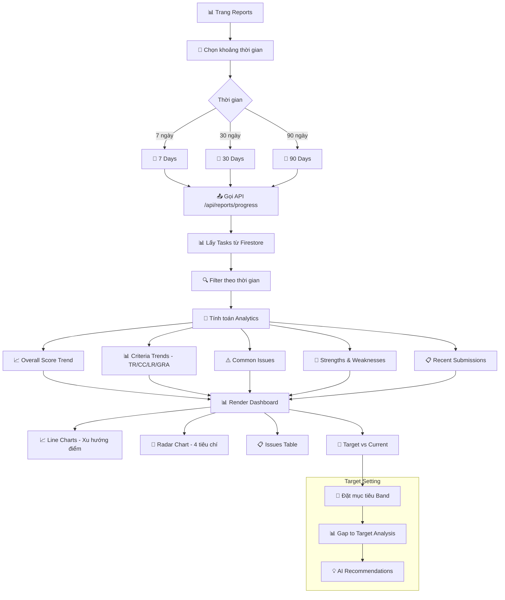

**Mô tả quy trình:**
1. Người dùng truy cập trang Reports
2. Chọn khoảng thời gian cần xem (7, 30, hoặc 90 ngày)
3. Hệ thống lấy dữ liệu từ Firestore
4. Tính toán các analytics:
   - Xu hướng điểm tổng thể
   - Xu hướng từng tiêu chí (TR, CC, LR, GRA)
   - Các lỗi phổ biến
   - Điểm mạnh và điểm yếu
5. Render các biểu đồ và bảng dữ liệu
6. Hiển thị Gap to Target nếu đã đặt mục tiêu

---

## 5. Sơ Đồ UML

### 📐 Use Case Diagram

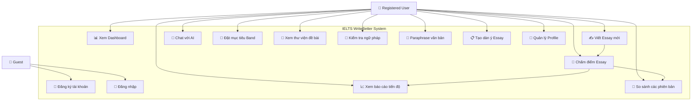

### 📊 Use Case Chi Tiết

| Use Case | Mô tả | Actor | Precondition | Postcondition |
|----------|-------|-------|--------------|---------------|
| UC1 - Đăng ký | Tạo tài khoản mới | Guest | Chưa có tài khoản | Có tài khoản, đăng nhập |
| UC2 - Đăng nhập | Truy cập hệ thống | Guest | Có tài khoản | Session được tạo |
| UC3 - Dashboard | Xem tổng quan | User | Đã đăng nhập | Hiển thị thông tin |
| UC4 - Viết Essay | Tạo bài viết mới | User | Đã đăng nhập | Task được tạo |
| UC5 - Chấm điểm | AI đánh giá bài | User | Có bài viết | Có điểm và feedback |
| UC6 - Chat AI | Hỏi đáp với AI | User | Đã đăng nhập | Nhận câu trả lời |
| UC7 - Báo cáo | Xem tiến độ | User | Có bài đã chấm | Hiển thị charts |
| UC8 - Mục tiêu | Đặt target band | User | Đã đăng nhập | Target được lưu |

---

### 🔄 Activity Diagram - Quy trình viết và chấm bài

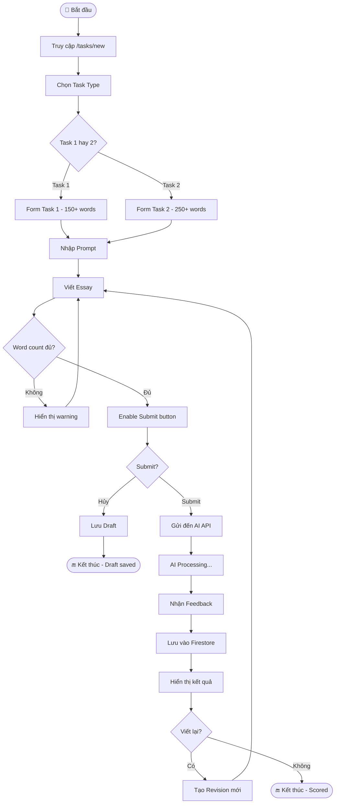

---

### 🔄 Activity Diagram - Quy trình xem báo cáo

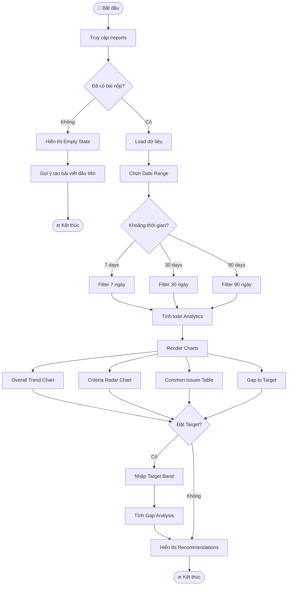

---

### 🔄 Activity Diagram - Quy trình Chat với AI

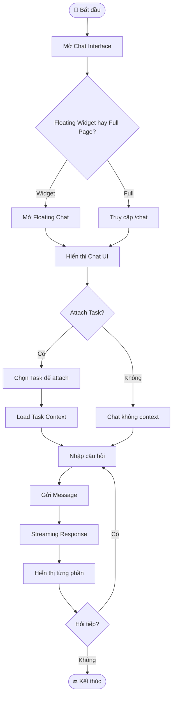

---

### 📦 Class Diagram

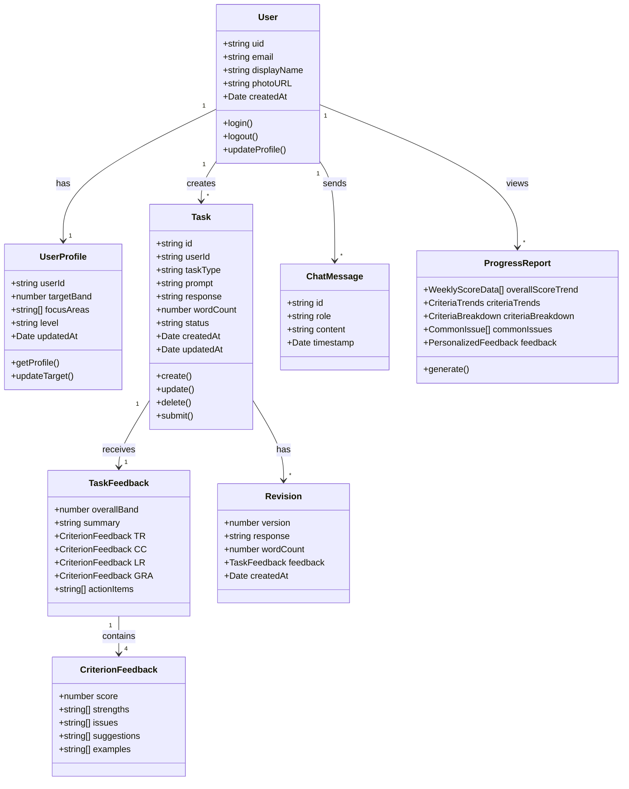

---

### 📬 Sequence Diagram - Chấm điểm Essay

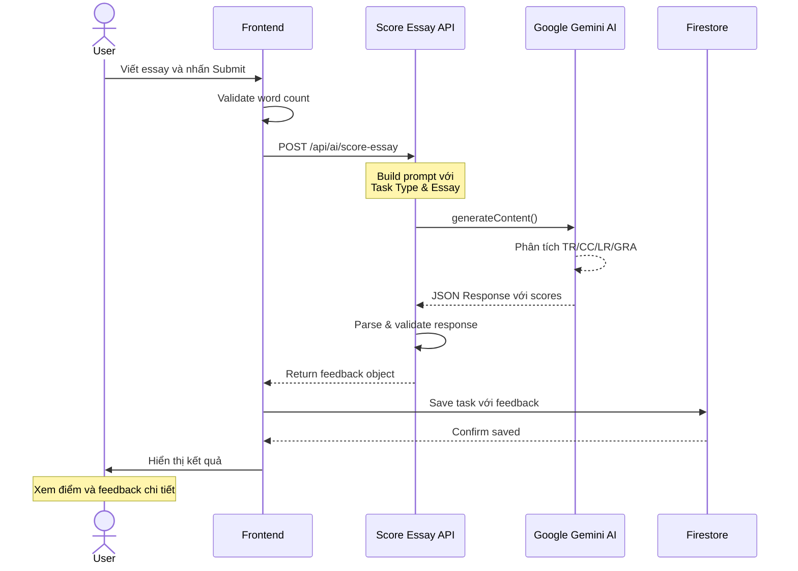

---

### 📬 Sequence Diagram - Đăng nhập

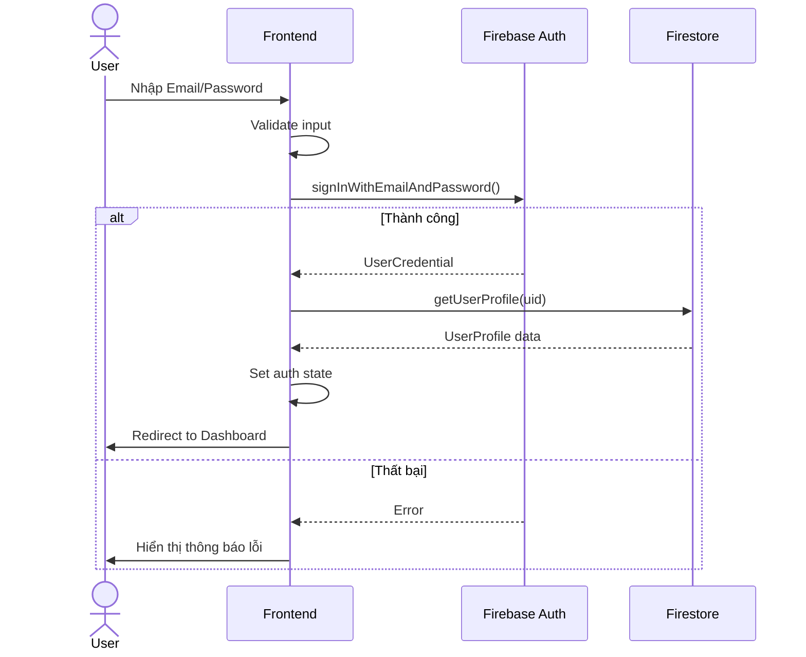

---

### 📬 Sequence Diagram - Chat với AI

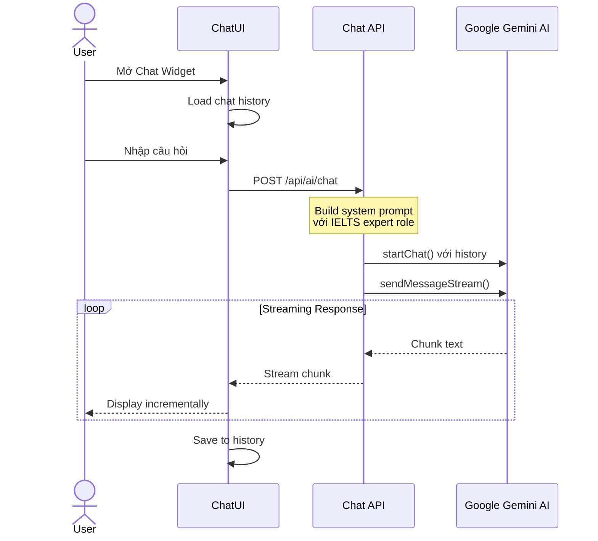

---

## 6. Giao Diện Ứng Dụng

### 🖼️ Trang Chủ (Home Page)

```
┌─────────────────────────────────────────────────────────────────────────┐
│  🏠 IELTS WriteBetter                    [Dashboard] [Login] [Register] │
├─────────────────────────────────────────────────────────────────────────┤
│                                                                         │
│                    🎯 IELTS WriteBetter                                 │
│                                                                         │
│              Luyện viết IELTS với AI Feedback                          │
│                                                                         │
│         Cải thiện kỹ năng viết của bạn với phản hồi chi tiết           │
│         dựa trên tiêu chí chấm điểm chính thức của IELTS               │
│                                                                         │
│              [🚀 Bắt đầu viết]    [💬 Thử Chatbot]                     │
│                                                                         │
├─────────────────────────────────────────────────────────────────────────┤
│                         ✨ Tính năng nổi bật                            │
├──────────────────┬──────────────────┬──────────────────┬────────────────┤
│  📊 Chấm điểm    │  💬 AI Feedback  │  🔄 So sánh      │  📈 Báo cáo   │
│  chính xác theo  │  chi tiết từng   │  các phiên bản   │  tiến độ      │
│  4 tiêu chí IELTS│  tiêu chí        │  bài viết        │  học tập      │
└──────────────────┴──────────────────┴──────────────────┴────────────────┘
```

### 🖼️ Dashboard

```
┌─────────────────────────────────────────────────────────────────────────┐
│  📊 Dashboard                [Tasks] [Chat] [Reports] [Profile] [👤]    │
├─────────────────────────────────────────────────────────────────────────┤
│                                                                         │
│  👋 Xin chào, [User Name]!                     🎯 Target: Band 7.0     │
│                                                                         │
├──────────────────────────────────────────────┬──────────────────────────┤
│                                              │                          │
│  ┌─────────────┐ ┌─────────────┐ ┌─────────┐ │      📊 Radar Chart     │
│  │   📈 6.5    │ │   🏆 7.0    │ │  📝 12  │ │                          │
│  │  Avg Score  │ │ Best Score  │ │ Essays  │ │         TR              │
│  └─────────────┘ └─────────────┘ └─────────┘ │        /  \             │
│                                              │    GRA ─── CC           │
│  📈 Xu hướng điểm gần đây                    │        \  /             │
│  ┌───────────────────────────────────┐       │         LR              │
│  │     *                             │       │                          │
│  │   *   *  *                        │       │  [Xem chi tiết →]       │
│  │  *         *                      │       │                          │
│  └───────────────────────────────────┘       │                          │
│                                              │                          │
├──────────────────────────────────────────────┴──────────────────────────┤
│                                                                         │
│  🎯 Gap to Target                    💡 Khuyến nghị                     │
│  ┌─────────────────────────────┐    ┌───────────────────────────────┐  │
│  │ TR  ████████░░  6.5 → 7.0   │    │ • Focus on Grammar structures │  │
│  │ CC  ███████░░░  6.0 → 7.0   │    │ • Expand vocabulary range     │  │
│  │ LR  ████████░░  6.5 → 7.0   │    │ • Practice complex sentences  │  │
│  │ GRA ██████░░░░  5.5 → 7.0   │    │ • Review coherence markers    │  │
│  └─────────────────────────────┘    └───────────────────────────────┘  │
│                                                                         │
├─────────────────────────────────────────────────────────────────────────┤
│  ⚡ Quick Actions                                                        │
│                                                                         │
│  [➕ Viết bài mới]  [📚 Chọn đề bài]  [💬 Hỏi AI]  [📊 Xem báo cáo]    │
│                                                                         │
└─────────────────────────────────────────────────────────────────────────┘
```

### 🖼️ Trang Viết Essay

```
┌─────────────────────────────────────────────────────────────────────────┐
│  ✍️ New Task                 [Dashboard] [Tasks] [Chat] [Reports] [👤]  │
├─────────────────────────────────────────────────────────────────────────┤
│                                                                         │
│  Task Type:  ○ Task 1 (Letter/Report)    ● Task 2 (Essay)              │
│                                                                         │
├─────────────────────────────────────────────────────────────────────────┤
│  📖 Prompt / Đề bài                                                     │
│  ┌─────────────────────────────────────────────────────────────────┐   │
│  │                                                                   │   │
│  │  Some people think that technology has made our lives too        │   │
│  │  complicated. Others believe that it has improved our quality    │   │
│  │  of life. Discuss both views and give your opinion.              │   │
│  │                                                                   │   │
│  └─────────────────────────────────────────────────────────────────┘   │
│                                                                         │
├─────────────────────────────────────────────────────────────────────────┤
│  ✍️ Your Response                                           📊 247 từ │
│  ┌─────────────────────────────────────────────────────────────────┐   │
│  │                                                                   │   │
│  │  In the modern era, technology has become an integral part of    │   │
│  │  our daily lives. While some argue that technological            │   │
│  │  advancements have introduced unnecessary complexity, I believe  │   │
│  │  that the benefits far outweigh the drawbacks.                   │   │
│  │                                                                   │   │
│  │  On one hand, critics point out that modern technology has       │   │
│  │  made life more stressful. The constant connectivity through     │   │
│  │  smartphones and social media can lead to information overload...│   │
│  │                                                                   │   │
│  └─────────────────────────────────────────────────────────────────┘   │
│                                                                         │
│  ⚠️ Task 2 yêu cầu tối thiểu 250 từ                                    │
│                                                                         │
│                               [💾 Save Draft]    [📤 Submit for Scoring]│
│                                                                         │
└─────────────────────────────────────────────────────────────────────────┘
```

### 🖼️ Trang Kết Quả Chấm Điểm

```
┌─────────────────────────────────────────────────────────────────────────┐
│  📊 Essay Feedback              [Dashboard] [Tasks] [Chat] [Reports]    │
├─────────────────────────────────────────────────────────────────────────┤
│                                                                         │
│  🎯 Overall Band Score                                                  │
│                                                                         │
│                    ╭───────────────╮                                    │
│                    │     6.5       │                                    │
│                    │   BAND SCORE  │                                    │
│                    ╰───────────────╯                                    │
│                                                                         │
├─────────────────────────────────────────────────────────────────────────┤
│  📊 Điểm từng tiêu chí                                                  │
│                                                                         │
│  ┌────────────────┐  ┌────────────────┐  ┌────────────────┐  ┌────────┐│
│  │  TR: 7.0       │  │  CC: 6.5       │  │  LR: 6.5       │  │GRA:6.0 ││
│  │ Task Response  │  │ Coherence      │  │ Lexical        │  │Grammar ││
│  └────────────────┘  └────────────────┘  └────────────────┘  └────────┘│
│                                                                         │
├─────────────────────────────────────────────────────────────────────────┤
│  💪 Điểm mạnh                                                           │
│  ┌─────────────────────────────────────────────────────────────────┐   │
│  │ ✓ Addresses both views clearly                                   │   │
│  │ ✓ Clear position stated in introduction                          │   │
│  │ ✓ Good use of linking words                                      │   │
│  │ ✓ Appropriate academic vocabulary                                │   │
│  └─────────────────────────────────────────────────────────────────┘   │
│                                                                         │
├─────────────────────────────────────────────────────────────────────────┤
│  ⚠️ Cần cải thiện                                                       │
│  ┌─────────────────────────────────────────────────────────────────┐   │
│  │ ⚠ Some grammatical errors in complex sentences                   │   │
│  │ ⚠ Limited range of vocabulary in conclusion                      │   │
│  │ ⚠ Could develop examples more fully                              │   │
│  └─────────────────────────────────────────────────────────────────┘   │
│                                                                         │
├─────────────────────────────────────────────────────────────────────────┤
│  💡 Gợi ý cải thiện                                                     │
│  ┌─────────────────────────────────────────────────────────────────┐   │
│  │ 1. Practice complex sentence structures with relative clauses    │   │
│  │ 2. Expand vocabulary with topic-specific collocations            │   │
│  │ 3. Include more specific examples to support arguments           │   │
│  └─────────────────────────────────────────────────────────────────┘   │
│                                                                         │
│                          [✏️ Viết lại]    [💬 Hỏi AI về feedback]       │
│                                                                         │
└─────────────────────────────────────────────────────────────────────────┘
```

### 🖼️ Trang Chat với AI

```
┌─────────────────────────────────────────────────────────────────────────┐
│  💬 AI Chat                    [Dashboard] [Tasks] [Reports] [Profile]  │
├─────────────────────────────────────────────────────────────────────────┤
│                                                                         │
│  📎 Attached: Technology Essay (Task 2)                    [❌ Remove] │
│                                                                         │
├─────────────────────────────────────────────────────────────────────────┤
│                                                                         │
│  👤 User                                              10:30 AM          │
│  ┌─────────────────────────────────────────────────────────────────┐   │
│  │ Bạn có thể giải thích tại sao điểm Grammar của tôi thấp không?  │   │
│  └─────────────────────────────────────────────────────────────────┘   │
│                                                                         │
│  🤖 IELTS Tutor                                       10:30 AM          │
│  ┌─────────────────────────────────────────────────────────────────┐   │
│  │ Dựa trên bài viết của bạn, tôi nhận thấy một số vấn đề về ngữ   │   │
│  │ pháp cần cải thiện:                                              │   │
│  │                                                                   │   │
│  │ 1. **Subject-verb agreement**: Ở đoạn 2, "The effects of        │   │
│  │    technology has..." nên là "have" vì "effects" là số nhiều.   │   │
│  │                                                                   │   │
│  │ 2. **Complex sentences**: Bạn có xu hướng viết câu dài nhưng    │   │
│  │    thiếu punctuation phù hợp.                                    │   │
│  │                                                                   │   │
│  │ **Gợi ý**: Hãy tập trung vào việc sử dụng relative clauses      │   │
│  │ (who, which, that) để tạo câu phức tạp hơn.                      │   │
│  └─────────────────────────────────────────────────────────────────┘   │
│                                                                         │
│  👤 User                                              10:32 AM          │
│  ┌─────────────────────────────────────────────────────────────────┐   │
│  │ Cho tôi một ví dụ về cách sử dụng relative clause được không?   │   │
│  └─────────────────────────────────────────────────────────────────┘   │
│                                                                         │
│  🤖 IELTS Tutor                                       10:32 AM          │
│  ┌─────────────────────────────────────────────────────────────────┐   │
│  │ Tất nhiên! Đây là ví dụ từ chính bài viết của bạn:              │   │
│  │                                                                   │   │
│  │ **Câu gốc**: "Technology helps people. People live in rural     │   │
│  │ areas."                                                          │   │
│  │                                                                   │   │
│  │ **Câu cải thiện**: "Technology significantly benefits people    │   │
│  │ who live in rural areas, where access to information was        │   │
│  │ previously limited."                                             │   │
│  │                                                                   │   │
│  │ Câu này sử dụng:                                                 │   │
│  │ - "who" để nối thông tin về người                                │   │
│  │ - "where" để thêm thông tin về địa điểm                          │   │
│  └─────────────────────────────────────────────────────────────────┘   │
│                                                                         │
├─────────────────────────────────────────────────────────────────────────┤
│  ┌─────────────────────────────────────────────────────────────────┐   │
│  │ Nhập câu hỏi của bạn...                              [📤 Gửi]  │   │
│  └─────────────────────────────────────────────────────────────────┘   │
│                                                                         │
└─────────────────────────────────────────────────────────────────────────┘
```

### 🖼️ Trang Báo Cáo Tiến Độ

```
┌─────────────────────────────────────────────────────────────────────────┐
│  📈 Progress Reports           [Dashboard] [Tasks] [Chat] [Profile]     │
├─────────────────────────────────────────────────────────────────────────┤
│                                                                         │
│  📅 Thời gian: [7 ngày ▼]          🎯 Target Band: 7.0 [⚙️ Thay đổi]   │
│                                                                         │
├──────────────────────────────────────────┬──────────────────────────────┤
│                                          │                              │
│  📈 Xu hướng điểm tổng thể               │  📊 Biểu đồ Radar           │
│  ┌──────────────────────────────────┐    │                              │
│  │        *                         │    │         TR: 6.8             │
│  │      *   *   *                   │    │           ●                 │
│  │    *       *   *                 │    │         /   \               │
│  │  *               *               │    │   GRA ●─────● CC            │
│  │ 6.0    6.2    6.5    6.5   6.8   │    │         \   /               │
│  └──────────────────────────────────┘    │           ●                 │
│                                          │         LR: 6.5             │
│  📊 +0.8 so với lần đầu                  │                              │
│                                          │                              │
├──────────────────────────────────────────┴──────────────────────────────┤
│                                                                         │
│  📊 Tiến độ từng tiêu chí                                               │
│  ┌─────────────────────────────────────────────────────────────────┐   │
│  │                                                                   │   │
│  │  TR  ━━━━━━━━━━━━━━━━━━━━━━━━━━━━━━━━━━━━━━━━━  6.8 (+0.5)       │   │
│  │  CC  ━━━━━━━━━━━━━━━━━━━━━━━━━━━━━━━━━━━━━━━━━  6.5 (+0.3)       │   │
│  │  LR  ━━━━━━━━━━━━━━━━━━━━━━━━━━━━━━━━━━━━━━━━━  6.5 (+0.4)       │   │
│  │  GRA ━━━━━━━━━━━━━━━━━━━━━━━━━━━━━━━━━━━━━━━━━  6.0 (+0.2)       │   │
│  │                                                                   │   │
│  └─────────────────────────────────────────────────────────────────┘   │
│                                                                         │
├─────────────────────────────────────────────────────────────────────────┤
│                                                                         │
│  ⚠️ Các lỗi phổ biến                                                    │
│  ┌──────────────────────────────────────────────────────────────────┐  │
│  │  # │ Lỗi                           │ Tiêu chí │ Tần suất │ Chi tiết │
│  │ ───┼───────────────────────────────┼──────────┼──────────┼────────│  │
│  │  1 │ Subject-verb agreement        │   GRA    │   High   │  [👁️]  │  │
│  │  2 │ Run-on sentences              │   GRA    │  Medium  │  [👁️]  │  │
│  │  3 │ Limited vocabulary range      │   LR     │  Medium  │  [👁️]  │  │
│  │  4 │ Weak paragraph transitions    │   CC     │   Low    │  [👁️]  │  │
│  └──────────────────────────────────────────────────────────────────┘  │
│                                                                         │
├─────────────────────────────────────────────────────────────────────────┤
│                                                                         │
│  🎯 Gap to Target (7.0)                                                 │
│  ┌─────────────────────────────────────────────────────────────────┐   │
│  │                                                                   │   │
│  │  TR   [████████████████░░░░] 6.8  →  7.0  Gap: 0.2  ✓ Gần đạt   │   │
│  │  CC   [████████████████░░░░] 6.5  →  7.0  Gap: 0.5  ⚠ Cần cải   │   │
│  │  LR   [████████████████░░░░] 6.5  →  7.0  Gap: 0.5  ⚠ Cần cải   │   │
│  │  GRA  [████████████░░░░░░░░] 6.0  →  7.0  Gap: 1.0  ❗ Ưu tiên   │   │
│  │                                                                   │   │
│  └─────────────────────────────────────────────────────────────────┘   │
│                                                                         │
│  💡 Khuyến nghị: Tập trung cải thiện GRA trước để đạt mục tiêu         │
│                                                                         │
└─────────────────────────────────────────────────────────────────────────┘
```

### 🖼️ Floating Chat Widget

```
                                                    ┌─────────────────────┐
                                                    │ 💬 IELTS AI Tutor   │
                                                    ├─────────────────────┤
                                                    │                     │
                                                    │ 🤖 Xin chào! Tôi    │
                                                    │ có thể giúp gì      │
                                                    │ cho bạn về IELTS    │
                                                    │ Writing?            │
                                                    │                     │
                                                    │ ┌─────────────────┐ │
                                                    │ │ Nhập câu hỏi... │ │
                                                    │ └─────────────────┘ │
                                                    │                     │
                                                    │ 📎 Attach Task      │
                                                    └─────────────────────┘
                                                              │
                                                              │
┌────────────────────────────────────────────────────────────┐│
│                                                            ││
│                    [Main Page Content]                     ││
│                                                            ││
│                                                            │▼
│                                                    ┌───────────┐
│                                                    │    💬     │
│                                                    │   Chat    │
│                                                    └───────────┘
└────────────────────────────────────────────────────────────┘
```

---

## 7. Cấu Trúc Dự Án

```
ielts-write-better-app/
├── 📁 app/                           # Next.js App Router
│   ├── 📁 api/                       # API Routes
│   │   ├── 📁 ai/                    # AI-related APIs
│   │   │   ├── 📁 chat/              # Chatbot API
│   │   │   ├── 📁 generate-outline/  # Tạo dàn ý
│   │   │   ├── 📁 generate-prompts/  # Tạo đề bài
│   │   │   ├── 📁 grammar-check/     # Kiểm tra ngữ pháp
│   │   │   ├── 📁 models/            # Quản lý AI models
│   │   │   ├── 📁 paraphrase/        # Paraphrase văn bản
│   │   │   └── 📁 score-essay/       # Chấm điểm bài viết
│   │   ├── 📁 essays/                # Essay APIs
│   │   │   ├── 📁 evaluate/          # Đánh giá bài viết
│   │   │   └── 📁 scored/            # Lấy bài đã chấm
│   │   └── 📁 reports/               # Report APIs
│   │       ├── 📁 analyze-submission-gap/
│   │       ├── 📁 improvement-suggestions/
│   │       ├── 📁 progress/
│   │       └── 📁 target/
│   ├── 📁 auth/                      # Trang xác thực
│   │   ├── 📁 forgot-password/
│   │   ├── 📁 login/
│   │   └── 📁 register/
│   ├── 📁 chart-demo/                # Demo biểu đồ
│   ├── 📁 chat/                      # Trang Chatbot
│   ├── 📁 dashboard/                 # Trang Dashboard
│   ├── 📁 practice/                  # Công cụ luyện tập
│   │   ├── 📁 grammar/               # Kiểm tra ngữ pháp
│   │   ├── 📁 paraphrase/            # Paraphrase tool
│   │   ├── 📁 planner/               # Essay planner
│   │   └── 📁 prompts/               # Thư viện đề bài
│   ├── 📁 profile/                   # Trang hồ sơ
│   ├── 📁 reports/                   # Trang báo cáo tiến độ
│   ├── 📁 tasks/                     # Quản lý bài viết
│   │   ├── 📁 [taskId]/              # Chi tiết bài viết
│   │   └── 📁 new/                   # Tạo bài mới
│   ├── 📄 globals.css                # CSS toàn cục
│   ├── 📄 layout.tsx                 # Layout chính
│   └── 📄 page.tsx                   # Trang chủ
│
├── 📁 components/                    # React Components
│   ├── 📁 auth/                      # Components xác thực
│   ├── 📁 chat/                      # Components chat
│   ├── 📁 dashboard/                 # Components dashboard
│   ├── 📁 home/                      # Components trang chủ
│   ├── 📁 navigation/                # Components điều hướng
│   ├── 📁 practice/                  # Components luyện tập
│   ├── 📁 profile/                   # Components hồ sơ
│   ├── 📁 reports/                   # Components báo cáo
│   ├── 📁 tasks/                     # Components tasks
│   └── 📁 ui/                        # UI Components cơ bản
│
├── 📁 hooks/                         # Custom React Hooks
│   └── 📄 use-toast.ts               # Toast notifications
│
├── 📁 lib/                           # Utility Functions
│   ├── 📄 ai.ts                      # Google AI SDK config
│   ├── 📄 firebase.ts                # Firebase initialization
│   ├── 📄 firebase-auth.ts           # Auth helpers
│   ├── 📄 firebase-firestore.ts      # Firestore helpers
│   ├── 📄 gemini-native.ts           # Native Gemini client
│   ├── 📄 report-analytics.ts        # Analytics calculations
│   ├── 📄 retry-utils.ts             # Retry logic
│   ├── 📄 server-rate-limiter.ts     # Rate limiting
│   └── 📄 utils.ts                   # General utilities
│
├── 📁 types/                         # TypeScript Types
│   ├── 📄 reports.ts                 # Report types
│   └── 📄 tasks.ts                   # Task types
│
├── 📁 styles/                        # Stylesheets
├── 📁 public/                        # Static assets
│
├── 📄 next.config.mjs                # Next.js config
├── 📄 package.json                   # Dependencies
├── 📄 tsconfig.json                  # TypeScript config
└── 📄 components.json                # shadcn/ui config
```

---

## 8. Chi Tiết Các File và Chức Năng

### 📁 Thư mục `/lib` - Core Utilities

#### `ai.ts` - Google AI SDK Configuration
```typescript
// Chức năng: Khởi tạo và quản lý Google Generative AI client
- ensureGeminiApiKey(): Kiểm tra API key tồn tại
- getGoogleClient(): Tạo Google AI client
- getGoogleModel(): Lấy model AI (mặc định: gemini-2.0-flash)
```

#### `gemini-native.ts` - Native Gemini Client
```typescript
// Chức năng: Client trực tiếp cho Gemini API
- getGeminiClient(): Khởi tạo GoogleGenerativeAI
- getGeminiModel(): Lấy model cho scoring (luôn dùng gemini-2.0-flash)
```

#### `firebase.ts` - Firebase Initialization
```typescript
// Chức năng: Khởi tạo Firebase services
- Exports: auth, db (Firestore), storage
```

#### `firebase-auth.ts` - Authentication Helpers
```typescript
// Chức năng: Quản lý xác thực người dùng
- useAuth(): Hook quản lý trạng thái đăng nhập
- signIn(): Đăng nhập bằng email/password
- signUp(): Đăng ký tài khoản mới
- signOutUser(): Đăng xuất
- resetPassword(): Gửi email đặt lại mật khẩu
- signInWithGoogle(): Đăng nhập bằng Google
```

#### `firebase-firestore.ts` - Firestore Helpers
```typescript
// Chức năng: CRUD operations cho dữ liệu
Tasks:
- createTask(): Tạo task mới
- getTasks(): Lấy danh sách tasks
- getTask(): Lấy chi tiết 1 task
- subscribeToTasks(): Realtime subscription
- updateTask(): Cập nhật task
- addRevisionToTask(): Thêm phiên bản mới
- deleteTask(): Xóa task

User Profile:
- getUserProfile(): Lấy thông tin user
- createUserProfile(): Tạo profile mới
- updateUserProfile(): Cập nhật profile
```

#### `report-analytics.ts` - Analytics Engine
```typescript
// Chức năng: Phân tích dữ liệu và tạo báo cáo
- filterTasksByDateRange(): Lọc tasks theo thời gian
- calculateOverallScoreTrend(): Tính xu hướng điểm
- calculateCriteriaTrends(): Xu hướng từng tiêu chí
- calculateCriteriaBreakdown(): Breakdown điểm trung bình
- extractCommonIssues(): Tìm lỗi phổ biến
- generatePersonalizedFeedback(): Tạo phản hồi cá nhân
- calculateSkillPriority(): Ưu tiên kỹ năng cần cải thiện
- generateStudyPlan(): Tạo kế hoạch học tập
- generateTargetBasedRecommendations(): Đề xuất dựa trên mục tiêu
```

### 📁 Thư mục `/types` - TypeScript Definitions

#### `tasks.ts`
```typescript
// Định nghĩa types cho Tasks
- CriterionKey: "TR" | "CC" | "LR" | "GRA"
- FeedbackCategory: "grammar" | "lexical" | "coherence" | "task_response"
- LineLevelFeedback: Phản hồi theo dòng
- CriterionFeedback: Phản hồi theo tiêu chí
- TaskFeedback: Toàn bộ phản hồi
- Revision: Phiên bản bài viết
- TaskDocument: Document trong Firestore
```

#### `reports.ts`
```typescript
// Định nghĩa types cho Reports
- WeeklyScoreData: Dữ liệu điểm theo tuần
- CriteriaScoreData: Điểm theo tiêu chí
- CommonIssue: Lỗi phổ biến
- CriteriaBreakdown: Phân tích tiêu chí
- PersonalizedFeedback: Phản hồi cá nhân
- ProgressReportData: Dữ liệu báo cáo tiến độ
- SkillPriority: Ưu tiên kỹ năng
- StudyPlan: Kế hoạch học tập
- TargetBasedRecommendations: Đề xuất theo mục tiêu
```

---

## 9. Các Trang Frontend

### 🏠 Trang Chủ (`/`)
**File:** `app/page.tsx`

| Thành phần | Mô tả |
|------------|-------|
| Hero Section | Giới thiệu app với slogan chính |
| Feature Grid | 4 tính năng chính: Scoring, Feedback, Compare, Reports |
| Demo Section | Demo interactive |
| Call to Action | Nút "Start a Task" và "Try Chatbot" |

### 📊 Dashboard (`/dashboard`)
**File:** `app/dashboard/page.tsx`

| Widget | Chức năng |
|--------|----------|
| Welcome Header | Chào mừng user, hiển thị target band |
| Overview Cards | Điểm trung bình, điểm cao nhất, số bài nộp |
| Target Setting | Đặt mục tiêu band score |
| Skill Priority | Biểu đồ ưu tiên kỹ năng |
| Key Recommendations | Top issues cần cải thiện |
| Study Plan | Kế hoạch học tập cá nhân |
| Radar Chart | Biểu đồ radar 4 tiêu chí |
| Recent Activity | Hoạt động gần đây |
| Quick Actions | Nút tạo task mới, pick prompt, chatbot |

### ✍️ Tasks Management
#### Danh sách Tasks (`/tasks`)
- Hiển thị tất cả bài viết
- Filter theo status, task type
- Sort theo ngày, điểm

#### Tạo Task Mới (`/tasks/new`)
- Chọn Task Type (Task 1/Task 2)
- Nhập prompt/đề bài
- Viết bài essay
- Nộp để chấm điểm

#### Chi Tiết Task (`/tasks/[taskId]`)
- Xem bài viết và phản hồi
- Xem điểm từng tiêu chí
- So sánh các phiên bản
- Xem gợi ý cải thiện

### 🛠️ Practice Tools

#### Grammar Checker (`/practice/grammar`)
**Component:** `components/practice/grammar-checker.tsx`
- Nhập văn bản cần kiểm tra
- AI phân tích lỗi ngữ pháp
- Giải thích chi tiết từng lỗi
- Gợi ý sửa chữa

#### Paraphrase Tool (`/practice/paraphrase`)
**Component:** `components/practice/paraphrase-tool.tsx`
- Nhập câu/đoạn văn gốc
- Chọn style paraphrase (Academic, Simple, Formal...)
- AI tạo các phiên bản paraphrase
- So sánh và học cách diễn đạt mới

#### Essay Planner (`/practice/planner`)
**Component:** `components/practice/essay-planner.tsx`
- Nhập đề bài
- AI tạo dàn ý chi tiết
- Gợi ý ý tưởng cho từng đoạn
- Export dàn ý

#### Prompts Library (`/practice/prompts`)
**Component:** `components/practice/prompts-library.tsx`
- Thư viện đề bài mẫu
- Filter theo topic, task type
- Lưu đề yêu thích
- Bắt đầu viết từ đề đã chọn

### 💬 AI Chatbot (`/chat`)
**Components:** 
- `components/chat/chat-interface.tsx`
- `components/chat/floating-chat-widget.tsx`

| Tính năng | Mô tả |
|-----------|-------|
| Hỏi đáp IELTS | Hỏi về kỹ năng Writing |
| Giải đáp thắc mắc | Giải thích ngữ pháp, từ vựng |
| Gợi ý cải thiện | Tips để nâng band |
| Floating Widget | Widget chat nổi trên mọi trang |

### 📈 Reports (`/reports`)
**Components:** `components/reports/`
- Progress charts theo thời gian
- Breakdown từng tiêu chí
- Common issues analysis
- Target vs Current comparison
- Gap to Target visualization

### 👤 Profile (`/profile`)
**Component:** `components/profile/profile-settings.tsx`
- Thông tin cá nhân
- Mục tiêu học tập
- Preferences settings
- Focus areas

### 🔐 Authentication
#### Login (`/auth/login`)
- Đăng nhập Email/Password
- Đăng nhập Google
- Remember me option

#### Register (`/auth/register`)
- Tạo tài khoản mới
- Xác nhận email

#### Forgot Password (`/auth/forgot-password`)
- Gửi email reset password

---

## 10. Backend API và Tính Năng

### 🤖 AI APIs (`/api/ai/`)

#### Score Essay API (`/api/ai/score-essay`)
```typescript
// Chức năng: Chấm điểm bài viết IELTS
Input: { essay, prompt, taskType }
Output: {
  overallBand: number,
  criteria: {
    TR: { score, strengths, issues, suggestions, examples },
    CC: { score, strengths, issues, suggestions, examples },
    LR: { score, strengths, issues, suggestions, examples },
    GRA: { score, strengths, issues, suggestions, examples }
  },
  summary: string,
  actionItems: string[]
}
```

#### Chat API (`/api/ai/chat`)
```typescript
// Chức năng: Chatbot AI hỗ trợ IELTS
Input: { message, history }
Output: { response: string }
```

#### Grammar Check API (`/api/ai/grammar-check`)
```typescript
// Chức năng: Kiểm tra ngữ pháp
Input: { text }
Output: { 
  errors: [{ text, correction, explanation }],
  correctedText: string
}
```

#### Paraphrase API (`/api/ai/paraphrase`)
```typescript
// Chức năng: Paraphrase văn bản
Input: { text, style }
Output: { 
  paraphrases: string[],
  explanations: string[]
}
```

#### Generate Outline API (`/api/ai/generate-outline`)
```typescript
// Chức năng: Tạo dàn ý essay
Input: { prompt, taskType }
Output: {
  introduction: string[],
  bodyParagraphs: [{ topic, points }],
  conclusion: string[]
}
```

#### Generate Prompts API (`/api/ai/generate-prompts`)
```typescript
// Chức năng: Tạo đề bài luyện tập
Input: { topic, difficulty, taskType }
Output: { prompts: string[] }
```

### 📊 Reports APIs (`/api/reports/`)

#### Progress API (`/api/reports/progress`)
```typescript
// Chức năng: Lấy dữ liệu báo cáo tiến độ
Input: { userId, dateRange, targetBand? }
Output: ProgressReportData
```

#### Target API (`/api/reports/target`)
```typescript
// Chức năng: Quản lý mục tiêu band
GET: Lấy target hiện tại
POST: Đặt/cập nhật target
```

#### Improvement Suggestions API (`/api/reports/improvement-suggestions`)
```typescript
// Chức năng: Gợi ý cải thiện chi tiết
Input: { issueName, relatedCriterion, userLevel }
Output: { suggestions: string }
```

#### Analyze Submission Gap API (`/api/reports/analyze-submission-gap`)
```typescript
// Chức năng: Phân tích khoảng cách đến mục tiêu
Input: { userId, taskId, targetBand }
Output: { analysis, recommendations }
```

### 📝 Essays APIs (`/api/essays/`)

#### Evaluate API (`/api/essays/evaluate`)
- Đánh giá bài viết
- Lưu kết quả vào Firestore

#### Scored API (`/api/essays/scored`)
- Lấy danh sách bài đã chấm

---

## 11. Các Widget và Category

### 📊 Dashboard Widgets

#### Radar Chart (`components/dashboard/radar-chart.tsx`)
| Tính năng | Mô tả |
|-----------|-------|
| Hiển thị | Biểu đồ radar 4 trục (TR/CC/LR/GRA) |
| Tương tác | Hover để xem chi tiết |
| Animation | Smooth transitions |

#### Overview Cards (`components/reports/overview-cards.tsx`)
| Card | Hiển thị |
|------|----------|
| Current Average | Điểm trung bình hiện tại |
| Best Score | Điểm cao nhất gần đây |
| Total Submissions | Tổng số bài nộp |
| Gap to Target | Khoảng cách đến mục tiêu |

#### Skill Priority Visualization (`components/reports/skill-priority-visualization.tsx`)
- Biểu đồ bar chart so sánh current vs target
- Color coding theo mức độ ưu tiên (high/medium/low)
- Labels rõ ràng cho từng skill

#### Gap to Target Table (`components/reports/gap-to-target-table.tsx`)
- Bảng chi tiết gap từng tiêu chí
- Priority indicators
- Recommendations cho từng skill

### 📈 Reports Widgets

#### Progress Reports (`components/reports/progress-reports.tsx`)
| Phần | Nội dung |
|------|----------|
| Score Trend | Line chart xu hướng điểm |
| Criteria Trends | 4 line charts cho 4 tiêu chí |
| Common Issues | Danh sách lỗi phổ biến |
| Personalized Feedback | AI-generated feedback |

#### Performance Comparison Chart (`components/reports/performance-comparison-chart.tsx`)
- So sánh performance qua các khoảng thời gian
- Multiple datasets

#### Recent Submissions Table (`components/reports/recent-submissions-table.tsx`)
- Bảng các bài nộp gần đây
- Link đến chi tiết
- Quick stats

#### Target Improvement Analysis (`components/reports/target-improvement-analysis.tsx`)
- Phân tích sâu về gap
- AI recommendations
- Action items

#### Target Recommendations (`components/reports/target-recommendations.tsx`)
- Recommendations dựa trên target
- Study plan
- Focus areas

#### Target Setting (`components/reports/target-setting.tsx`)
| Input | Validation |
|-------|------------|
| Target Band | 5.0 - 8.5 |
| Deadline | Optional date picker |
| Save/Update | Lưu vào Firestore |

### ✍️ Tasks Widgets

#### Tasks Table (`components/tasks/tasks-table.tsx`)
| Column | Nội dung |
|--------|----------|
| Title | Tên bài viết |
| Type | Task 1/Task 2 |
| Status | Draft/Submitted/Scored |
| Score | Overall band |
| Date | Ngày cập nhật |
| Actions | View, Edit, Delete |

#### Task Detail (`components/tasks/task-detail.tsx`)
| Section | Nội dung |
|---------|----------|
| Prompt | Đề bài |
| Response | Bài viết |
| Feedback | Phản hồi AI chi tiết |
| Scores | Điểm từng tiêu chí |
| Suggestions | Gợi ý cải thiện |

#### Compare Versions (`components/tasks/compare-versions.tsx`)
- Side-by-side diff view
- Highlight changes
- Score comparison

#### New Task Form (`components/tasks/new-task-form.tsx`)
| Field | Type |
|-------|------|
| Task Type | Select (Task 1/Task 2) |
| Prompt | Textarea |
| Response | Textarea với word count |
| Submit | Button với loading state |

### 🛠️ Practice Widgets

#### Grammar Checker (`components/practice/grammar-checker.tsx`)
| Tính năng | Mô tả |
|-----------|-------|
| Input | Textarea cho văn bản |
| Check Button | Gửi kiểm tra |
| Results | Danh sách lỗi với giải thích |
| Corrected Text | Văn bản đã sửa |

#### Paraphrase Tool (`components/practice/paraphrase-tool.tsx`)
| Option | Style |
|--------|-------|
| Academic | Phong cách học thuật |
| Simple | Đơn giản, dễ hiểu |
| Formal | Trang trọng |
| Creative | Sáng tạo |

#### Essay Planner (`components/practice/essay-planner.tsx`)
| Section | Output |
|---------|--------|
| Introduction | Thesis + hook ideas |
| Body Paragraphs | Topic sentences + supporting points |
| Conclusion | Summary + final thoughts |

#### Prompts Library (`components/practice/prompts-library.tsx`)
| Filter | Options |
|--------|---------|
| Topic | Education, Technology, Environment... |
| Task Type | Task 1, Task 2 |
| Difficulty | Easy, Medium, Hard |

---

## 12. UI Components

### 📦 Shadcn/UI Components (`components/ui/`)

| Component | File | Mô tả |
|-----------|------|-------|
| Avatar | `avatar.tsx` | Hiển thị avatar user |
| Badge | `badge.tsx` | Labels và tags |
| Button | `button.tsx` | Nút bấm với variants |
| Card | `card.tsx` | Container card |
| Collapsible | `collapsible.tsx` | Expandable content |
| Dialog | `dialog.tsx` | Modal dialogs |
| Dropdown Menu | `dropdown-menu.tsx` | Menu dropdown |
| Empty State | `empty-state.tsx` | Trạng thái rỗng |
| Input | `input.tsx` | Text input |
| Label | `label.tsx` | Form labels |
| Markdown | `markdown.tsx` | Render markdown |
| Page with TOC | `page-with-toc.tsx` | Page với Table of Contents |
| Progress | `progress.tsx` | Progress bar |
| Scroll Area | `scroll-area.tsx` | Scrollable container |
| Select | `select.tsx` | Dropdown select |
| Switch | `switch.tsx` | Toggle switch |
| Table of Contents | `table-of-contents.tsx` | Auto-generated TOC |
| Tabs | `tabs.tsx` | Tab navigation |
| Textarea | `textarea.tsx` | Multi-line input |
| Toast | `toast.tsx`, `toaster.tsx` | Notifications |

### 🎨 Custom Components

#### Navigation (`components/navigation/`)
| Component | Mô tả |
|-----------|-------|
| Top Nav | Header navigation |
| Secondary Nav | Sub-navigation |

#### Theme Components
| Component | Mô tả |
|-----------|-------|
| Theme Provider | Context provider cho theme |
| Theme Toggle | Button chuyển dark/light mode |

---

## 13. Hệ Thống Authentication

### 🔐 Flow Authentication

```
┌─────────────┐     ┌──────────────┐     ┌─────────────┐
│   User      │────▶│   Firebase   │────▶│   App       │
│   Action    │     │   Auth       │     │   State     │
└─────────────┘     └──────────────┘     └─────────────┘
      │                    │                    │
      │  1. Login/Register │                    │
      │───────────────────▶│                    │
      │                    │  2. Verify         │
      │                    │─────────▶          │
      │                    │                    │
      │                    │  3. Return Token   │
      │◀───────────────────│                    │
      │                    │                    │
      │  4. Token in State │                    │
      │────────────────────────────────────────▶│
      │                    │                    │
      │  5. Access Protected Routes             │
      │◀────────────────────────────────────────│
```

### Components

#### Auth Provider (`components/auth/auth-provider.tsx`)
- Context provider cho auth state
- useAuth hook
- Realtime auth state updates

#### Protected Route (`components/auth/protected-route.tsx`)
- HOC bảo vệ routes
- Redirect về login nếu chưa đăng nhập
- Loading state

#### Login Form (`components/auth/login-form.tsx`)
- Email/Password fields
- Google Sign In button
- Validation với zod
- Error handling

#### Register Form (`components/auth/register-form.tsx`)
- Name, Email, Password fields
- Password confirmation
- Terms acceptance

#### Forgot Password Form (`components/auth/forgot-password-form.tsx`)
- Email input
- Send reset email
- Success/Error states

---

## 14. Tổng Kết

### ✅ Điểm Mạnh

| Điểm mạnh | Chi tiết |
|-----------|----------|
| **Công nghệ hiện đại** | Next.js 15, React 19, TypeScript, Tailwind CSS v4 |
| **AI Integration** | Google Gemini 2.0 Flash cho chấm điểm chính xác |
| **Real-time Updates** | Firestore real-time subscriptions |
| **UI/UX** | Shadcn/ui components, dark/light mode |
| **Type Safety** | Full TypeScript coverage |
| **Authentication** | Firebase Auth với multiple providers |
| **Analytics** | Comprehensive progress tracking |
| **Personalization** | Target-based recommendations |

### ⚠️ Hạn Chế Hiện Tại

| Hạn chế | Impact |
|---------|--------|
| Phụ thuộc API key | Cần Gemini API key để hoạt động |
| Rate limiting | Giới hạn requests |
| Offline support | Chưa có PWA/offline |
| Mobile app | Chỉ có web version |
| Multi-language | Chỉ hỗ trợ tiếng Anh |

---

## 15. Đề Xuất Cải Thiện

### 🚀 Cải Thiện Ngắn Hạn (1-3 tháng)

| Đề xuất | Mô tả | Priority |
|---------|-------|----------|
| **PWA Support** | Thêm Service Worker, offline mode | High |
| **Caching** | Cache AI responses để giảm API calls | High |
| **Export PDF** | Export báo cáo ra PDF | Medium |
| **Writing Timer** | Đếm thời gian viết như thi thật | Medium |
| **Vocabulary Bank** | Lưu từ vựng hay từ AI feedback | Medium |

### 📱 Cải Thiện Trung Hạn (3-6 tháng)

| Đề xuất | Mô tả | Priority |
|---------|-------|----------|
| **Mobile App** | React Native app | High |
| **Speaking Practice** | Thêm module luyện Speaking | High |
| **Reading/Listening** | Expand sang các kỹ năng khác | Medium |
| **Social Features** | Học nhóm, compare với bạn bè | Medium |
| **Gamification** | Badges, achievements, leaderboard | Low |

### 🌐 Cải Thiện Dài Hạn (6+ tháng)

| Đề xuất | Mô tả | Priority |
|---------|-------|----------|
| **Multi-language UI** | Tiếng Việt, Trung, Hàn... | High |
| **AI Model Options** | Cho phép chọn AI model | Medium |
| **Teacher Dashboard** | Quản lý lớp học cho giáo viên | Medium |
| **Enterprise Version** | Version cho tổ chức giáo dục | Medium |
| **Marketplace** | Marketplace cho prompts/templates | Low |

### 💡 Đề Xuất Kỹ Thuật

```
1. Performance Optimization
   - Image optimization với next/image
   - Code splitting
   - Lazy loading components
   
2. Testing
   - Unit tests với Jest
   - E2E tests với Playwright
   - Component tests với Testing Library
   
3. CI/CD
   - GitHub Actions cho automated testing
   - Automated deployment
   - Performance monitoring
   
4. Security
   - Rate limiting enhancement
   - Input sanitization
   - CORS policies
   - CSP headers

5. Scalability
   - Edge functions
   - CDN optimization
   - Database indexing
```

### 📊 Metrics Cần Theo Dõi

| Metric | Tool |
|--------|------|
| User engagement | Google Analytics |
| API response time | Vercel Analytics |
| Error rates | Sentry |
| User satisfaction | In-app feedback |
| Feature usage | Custom analytics |

---

## 📝 Ghi Chú Cuối

**IELTS WriteBetter** là một ứng dụng hoàn chỉnh với đầy đủ tính năng cần thiết cho việc luyện viết IELTS. Với nền tảng công nghệ vững chắc và khả năng mở rộng tốt, ứng dụng có tiềm năng phát triển thành một platform giáo dục toàn diện cho người học IELTS.

---

**Ngày tạo báo cáo:** 02/12/2025

**Phiên bản:** 1.0

**Tác giả:** AI-Generated Report

---

*Báo cáo này được tạo tự động dựa trên phân tích cấu trúc mã nguồn của dự án IELTS WriteBetter.*
