```mermaid
graph LR
    Guest[👤 Guest] --> UC1[UC1: Đăng ký]
    Guest --> UC2[UC2: Đăng nhập]
    Guest --> UC4[UC4: Quên mật khẩu]
    Guest --> UC5[UC5: Đăng nhập Google]
    
    User[👥 User] --> UC2
    User --> UC3[UC3: Đăng xuất]
    User --> UC5
    
    Firebase[🔥 Firebase] -.->|manages| UC1
    Firebase -.->|manages| UC2
    Firebase -.->|manages| UC3
    Firebase -.->|manages| UC4
    Firebase -.->|manages| UC5
```

```mermaid
graph TB
    User[👥 User] --> UC9[UC9: Tạo task mới]
    User --> UC10[UC10: Viết essay]
    User --> UC11[UC11: Nộp bài]
    User --> UC12[UC12: Xem feedback]
    User --> UC13[UC13: Xem danh sách]
    User --> UC14[UC14: Chỉnh sửa]
    User --> UC15[UC15: Xóa]
    User --> UC16[UC16: So sánh versions]
    
    UC11 -.->|include| UC21[UC21: AI chấm điểm]
    AI[🤖 AI System] -.->|executes| UC21
    
    UC9 -.->|can extend from| UC25[UC25: Bắt đầu từ prompt]
```

```mermaid
graph TB
    User[👥 User] --> UC17[UC17: Chat với AI]
    User --> UC18[UC18: Kiểm tra ngữ pháp]
    User --> UC19[UC19: Paraphrase]
    User --> UC20[UC20: Tạo dàn ý]
    
    AI[🤖 AI System] -.->|executes| UC17
    AI -.->|executes| UC18
    AI -.->|executes| UC19
    AI -.->|executes| UC20
    AI -.->|executes| UC21[UC21: Chấm điểm]
```

```mermaid
graph TB
    User[👥 User] --> UC26[UC26: Xem báo cáo]
    User --> UC30[UC30: Đặt mục tiêu]
    
    UC26 -.->|include| UC27[UC27: Chọn thời gian]
    UC26 -.->|include| UC28[UC28: Xem xu hướng]
    UC26 -.->|include| UC29[UC29: Xem lỗi phổ biến]
    
    UC30 -.->|include| UC31[UC31: Xem Gap to Target]
    UC31 -.->|include| UC32[UC32: Nhận gợi ý]
    
    AI[🤖 AI] -.->|generates| UC32
```

```mermaid
graph TB
    User[👥 User] --> UC33[UC33: Xem profile]
    User --> UC34[UC34: Cập nhật thông tin]
    User --> UC35[UC35: Đặt mục tiêu học tập]
    User --> UC36[UC36: Cài đặt preferences]
    
    UC33 --> UC34
    UC33 --> UC35
    UC33 --> UC36
```

# 📊 SƠ ĐỒ USE CASE - IELTS WRITEBETTER

---

## 📋 Mục Lục

1. [Tổng Quan Hệ Thống](#1-tổng-quan-hệ-thống)
2. [Danh Sách Actors](#2-danh-sách-actors)
3. [Sơ Đồ Use Case Tổng Thể](#3-sơ-đồ-use-case-tổng-thể)
4. [Chi Tiết Các Use Case](#4-chi-tiết-các-use-case)
5. [Use Case Diagrams Theo Module](#5-use-case-diagrams-theo-module)
6. [Bảng Mô Tả Use Case](#6-bảng-mô-tả-use-case)

---

## 1. Tổng Quan Hệ Thống

**IELTS WriteBetter** là hệ thống hỗ trợ luyện viết IELTS với AI, cung cấp các tính năng:
- Đăng ký và xác thực người dùng
- Viết và chấm điểm bài essay IELTS
- Chat với AI tutor
- Theo dõi tiến độ học tập
- Công cụ luyện tập (Grammar, Paraphrase, Planner)
- Thư viện đề bài

---

## 2. Danh Sách Actors

### 👤 Guest (Khách)
**Mô tả:** Người dùng chưa đăng ký tài khoản, có thể xem thông tin công khai của hệ thống.

**Quyền hạn:**
- Xem trang chủ
- Xem tính năng demo
- Đăng ký tài khoản mới
- Đăng nhập vào hệ thống

---

### 👥 Registered User (Người dùng đã đăng ký)
**Mô tả:** Người dùng đã có tài khoản, đã đăng nhập vào hệ thống.

**Quyền hạn:**
- Tất cả quyền của Guest
- Quản lý hồ sơ cá nhân
- Tạo và quản lý bài viết
- Sử dụng các công cụ luyện tập
- Chat với AI tutor
- Xem báo cáo tiến độ
- Đặt mục tiêu học tập

---

### 🤖 AI System (Hệ thống AI)
**Mô tả:** Google Gemini AI - Actor hệ thống tự động xử lý các yêu cầu AI.

**Chức năng:**
- Chấm điểm bài viết IELTS
- Tạo feedback chi tiết
- Trả lời câu hỏi của người dùng
- Kiểm tra ngữ pháp
- Paraphrase văn bản
- Tạo dàn ý essay
- Tạo đề bài luyện tập

---

### 🔥 Firebase System
**Mô tả:** Backend-as-a-Service xử lý xác thực, lưu trữ dữ liệu.

**Chức năng:**
- Xác thực người dùng (Email/Password, Google OAuth)
- Lưu trữ dữ liệu trong Firestore
- Quản lý session
- Lưu trữ file

---

## 3. Sơ Đồ Use Case Tổng Thể

```mermaid
graph TB
    subgraph "IELTS WriteBetter System"
        subgraph "Authentication Module"
            UC1[UC1: Đăng ký tài khoản]
            UC2[UC2: Đăng nhập]
            UC3[UC3: Đăng xuất]
            UC4[UC4: Quên mật khẩu]
            UC5[UC5: Đăng nhập Google]
        end
        
        subgraph "Dashboard Module"
            UC6[UC6: Xem Dashboard]
            UC7[UC7: Xem tổng quan điểm số]
            UC8[UC8: Xem xu hướng tiến độ]
        end
        
        subgraph "Task Management Module"
            UC9[UC9: Tạo task mới]
            UC10[UC10: Viết essay]
            UC11[UC11: Nộp bài để chấm điểm]
            UC12[UC12: Xem feedback]
            UC13[UC13: Xem danh sách tasks]
            UC14[UC14: Chỉnh sửa task]
            UC15[UC15: Xóa task]
            UC16[UC16: So sánh các phiên bản]
        end
        
        subgraph "AI Features Module"
            UC17[UC17: Chat với AI tutor]
            UC18[UC18: Kiểm tra ngữ pháp]
            UC19[UC19: Paraphrase văn bản]
            UC20[UC20: Tạo dàn ý essay]
            UC21[UC21: Chấm điểm essay]
        end
        
        subgraph "Practice Tools Module"
            UC22[UC22: Xem thư viện đề bài]
            UC23[UC23: Lọc đề bài theo chủ đề]
            UC24[UC24: Lưu đề yêu thích]
            UC25[UC25: Bắt đầu viết từ đề có sẵn]
        end
        
        subgraph "Progress Reports Module"
            UC26[UC26: Xem báo cáo tiến độ]
            UC27[UC27: Chọn khoảng thời gian]
            UC28[UC28: Xem xu hướng điểm số]
            UC29[UC29: Xem các lỗi phổ biến]
            UC30[UC30: Đặt mục tiêu Band]
            UC31[UC31: Xem Gap to Target]
            UC32[UC32: Nhận gợi ý cải thiện]
        end
        
        subgraph "Profile Module"
            UC33[UC33: Xem profile]
            UC34[UC34: Cập nhật thông tin]
            UC35[UC35: Đặt mục tiêu học tập]
            UC36[UC36: Cài đặt preferences]
        end
    end
    
    Guest[👤 Guest] -->|uses| UC1
    Guest -->|uses| UC2
    Guest -->|uses| UC4
    Guest -->|uses| UC5
    
    User[👥 Registered User] -->|uses| UC2
    User -->|uses| UC3
    User -->|uses| UC5
    User -->|uses| UC6
    User -->|uses| UC7
    User -->|uses| UC8
    User -->|uses| UC9
    User -->|uses| UC10
    User -->|uses| UC11
    User -->|uses| UC12
    User -->|uses| UC13
    User -->|uses| UC14
    User -->|uses| UC15
    User -->|uses| UC16
    User -->|uses| UC17
    User -->|uses| UC18
    User -->|uses| UC19
    User -->|uses| UC20
    User -->|uses| UC22
    User -->|uses| UC23
    User -->|uses| UC24
    User -->|uses| UC25
    User -->|uses| UC26
    User -->|uses| UC27
    User -->|uses| UC28
    User -->|uses| UC29
    User -->|uses| UC30
    User -->|uses| UC31
    User -->|uses| UC32
    User -->|uses| UC33
    User -->|uses| UC34
    User -->|uses| UC35
    User -->|uses| UC36
    
    AI[🤖 AI System] -->|executes| UC21
    AI -->|executes| UC17
    AI -->|executes| UC18
    AI -->|executes| UC19
    AI -->|executes| UC20
    AI -->|executes| UC32
    
    Firebase[🔥 Firebase] -->|manages| UC1
    Firebase -->|manages| UC2
    Firebase -->|manages| UC3
    Firebase -->|manages| UC4
    Firebase -->|manages| UC5
    
    UC11 -.->|include| UC21
    UC9 -.->|extends| UC25
    UC26 -.->|include| UC28
    UC26 -.->|include| UC29
    UC30 -.->|include| UC31
```

---

## 4. Chi Tiết Các Use Case

### 🔐 Authentication Module

#### UC1: Đăng ký tài khoản
**Actor:** Guest

**Mô tả:** Người dùng mới tạo tài khoản trong hệ thống.

**Precondition:**
- Chưa có tài khoản
- Truy cập trang đăng ký

**Main Flow:**
1. Guest truy cập trang đăng ký
2. Guest chọn phương thức đăng ký (Email/Password)
3. Guest nhập thông tin: Email, Password, Tên hiển thị
4. Guest chấp nhận điều khoản sử dụng
5. Hệ thống validate dữ liệu
6. Firebase Auth tạo tài khoản
7. Hệ thống tạo User Profile trong Firestore
8. Hệ thống chuyển hướng đến Dashboard

**Alternative Flow:**
- 5a. Dữ liệu không hợp lệ → Hiển thị lỗi, quay lại bước 3
- 6a. Email đã tồn tại → Hiển thị thông báo, quay lại bước 3

**Postcondition:**
- Tài khoản được tạo thành công
- Người dùng đăng nhập tự động

---

#### UC2: Đăng nhập
**Actor:** Guest, Registered User

**Mô tả:** Người dùng đăng nhập vào hệ thống.

**Precondition:**
- Đã có tài khoản
- Truy cập trang đăng nhập

**Main Flow:**
1. User truy cập trang đăng nhập
2. User chọn phương thức đăng nhập (Email/Password)
3. User nhập Email và Password
4. User nhấn nút "Đăng nhập"
5. Firebase Auth xác thực thông tin
6. Hệ thống tạo session
7. Hệ thống load User Profile từ Firestore
8. Hệ thống chuyển hướng đến Dashboard

**Alternative Flow:**
- 5a. Thông tin sai → Hiển thị lỗi, quay lại bước 3
- 5b. Tài khoản bị khóa → Hiển thị thông báo

**Postcondition:**
- User đăng nhập thành công
- Session được tạo

---

#### UC3: Đăng xuất
**Actor:** Registered User

**Mô tả:** Người dùng đăng xuất khỏi hệ thống.

**Main Flow:**
1. User nhấn nút "Đăng xuất"
2. Hệ thống hủy session
3. Firebase Auth đăng xuất
4. Hệ thống chuyển về trang chủ

**Postcondition:**
- User đã đăng xuất
- Session bị hủy

---

#### UC4: Quên mật khẩu
**Actor:** Guest

**Mô tả:** Người dùng yêu cầu đặt lại mật khẩu.

**Main Flow:**
1. Guest nhấn "Quên mật khẩu?"
2. Guest nhập email
3. Hệ thống kiểm tra email tồn tại
4. Firebase Auth gửi email đặt lại mật khẩu
5. Hệ thống hiển thị thông báo thành công

**Alternative Flow:**
- 3a. Email không tồn tại → Hiển thị lỗi

**Postcondition:**
- Email reset password được gửi

---

#### UC5: Đăng nhập Google
**Actor:** Guest, Registered User

**Mô tả:** Đăng nhập bằng tài khoản Google.

**Main Flow:**
1. User nhấn "Sign in with Google"
2. Popup Google OAuth xuất hiện
3. User chọn tài khoản Google
4. Google xác thực
5. Firebase Auth tạo/lấy tài khoản
6. Nếu tài khoản mới, tạo User Profile
7. Hệ thống chuyển đến Dashboard

**Postcondition:**
- User đăng nhập thành công

---

### 📊 Dashboard Module

#### UC6: Xem Dashboard
**Actor:** Registered User

**Mô tả:** User xem tổng quan về tiến độ học tập.

**Main Flow:**
1. User đăng nhập và truy cập Dashboard
2. Hệ thống load dữ liệu từ Firestore
3. Hệ thống tính toán analytics
4. Hệ thống hiển thị:
   - Điểm trung bình
   - Điểm cao nhất
   - Số bài đã nộp
   - Radar chart 4 tiêu chí
   - Gap to Target
   - Recommendations
   - Recent activities

**Postcondition:**
- Dashboard được hiển thị với dữ liệu đầy đủ

---

#### UC7: Xem tổng quan điểm số
**Actor:** Registered User

**Mô tả:** User xem các thống kê về điểm số.

**Main Flow:**
1. User xem Dashboard
2. Hệ thống hiển thị:
   - Overall average score
   - Best score gần đây
   - Score breakdown theo tiêu chí
   - Radar chart

**Include:** UC6

---

#### UC8: Xem xu hướng tiến độ
**Actor:** Registered User

**Mô tả:** User xem xu hướng cải thiện qua thời gian.

**Main Flow:**
1. User xem Dashboard
2. Hệ thống hiển thị:
   - Line chart xu hướng điểm
   - Progress indicators
   - Improvement rate

**Include:** UC6

---

### ✍️ Task Management Module

#### UC9: Tạo task mới
**Actor:** Registered User

**Mô tả:** User tạo bài viết mới.

**Precondition:**
- User đã đăng nhập

**Main Flow:**
1. User nhấn "Tạo task mới"
2. User chọn Task Type (Task 1 hoặc Task 2)
3. User nhập hoặc chọn prompt/đề bài
4. Hệ thống tạo task trong Firestore với status "draft"
5. Hệ thống chuyển đến trang viết bài

**Postcondition:**
- Task mới được tạo với status "draft"

---

#### UC10: Viết essay
**Actor:** Registered User

**Mô tả:** User viết bài essay.

**Main Flow:**
1. User truy cập task
2. User viết bài trong editor
3. Hệ thống tự động đếm số từ
4. Hệ thống hiển thị warning nếu thiếu từ
5. User nhấn "Save Draft" để lưu
6. Hệ thống lưu vào Firestore

**Postcondition:**
- Bài viết được lưu

---

#### UC11: Nộp bài để chấm điểm
**Actor:** Registered User

**Mô tả:** User nộp bài để AI chấm điểm.

**Precondition:**
- Đã viết đủ số từ yêu cầu

**Main Flow:**
1. User nhấn "Submit for Scoring"
2. Hệ thống validate word count
3. Hệ thống gửi request đến AI API
4. AI System chấm điểm (UC21)
5. Hệ thống nhận kết quả
6. Hệ thống lưu feedback vào Firestore
7. Hệ thống cập nhật status = "scored"
8. Hệ thống hiển thị kết quả

**Alternative Flow:**
- 2a. Thiếu từ → Hiển thị warning, không submit

**Postcondition:**
- Bài viết được chấm điểm
- Feedback được lưu

**Include:** UC21 (Chấm điểm essay)

---

#### UC12: Xem feedback
**Actor:** Registered User

**Mô tả:** User xem kết quả chấm điểm chi tiết.

**Main Flow:**
1. User truy cập task đã chấm
2. Hệ thống hiển thị:
   - Overall Band Score
   - Điểm từng tiêu chí (TR, CC, LR, GRA)
   - Strengths
   - Issues
   - Suggestions
   - Examples
   - Action items

**Postcondition:**
- Feedback được hiển thị đầy đủ

---

#### UC13: Xem danh sách tasks
**Actor:** Registered User

**Mô tả:** User xem tất cả bài viết của mình.

**Main Flow:**
1. User truy cập trang Tasks
2. Hệ thống load tasks từ Firestore
3. Hệ thống hiển thị bảng tasks với:
   - Title
   - Type
   - Status
   - Score
   - Date
   - Actions
4. User có thể filter và sort

**Postcondition:**
- Danh sách tasks được hiển thị

---

#### UC14: Chỉnh sửa task
**Actor:** Registered User

**Mô tả:** User chỉnh sửa bài viết.

**Main Flow:**
1. User chọn task cần sửa
2. User chỉnh sửa prompt hoặc response
3. User lưu thay đổi
4. Hệ thống cập nhật trong Firestore

**Postcondition:**
- Task được cập nhật

---

#### UC15: Xóa task
**Actor:** Registered User

**Mô tả:** User xóa bài viết.

**Main Flow:**
1. User chọn task cần xóa
2. Hệ thống hiển thị xác nhận
3. User xác nhận xóa
4. Hệ thống xóa khỏi Firestore

**Postcondition:**
- Task bị xóa

---

#### UC16: So sánh các phiên bản
**Actor:** Registered User

**Mô tả:** User so sánh các revision của bài viết.

**Main Flow:**
1. User chọn task có nhiều revisions
2. User chọn 2 revisions để so sánh
3. Hệ thống hiển thị side-by-side comparison
4. Hệ thống highlight thay đổi
5. Hệ thống so sánh scores

**Postcondition:**
- Comparison được hiển thị

---

### 🤖 AI Features Module

#### UC17: Chat với AI tutor
**Actor:** Registered User

**Mô tả:** User chat với AI để hỏi về IELTS Writing.

**Main Flow:**
1. User mở Chat interface
2. User nhập câu hỏi
3. Hệ thống gửi request đến AI API
4. AI System xử lý và trả lời
5. Hệ thống hiển thị câu trả lời (streaming)
6. User có thể hỏi tiếp

**Alternative Flow:**
- 2a. User attach task → AI có context về bài viết

**Postcondition:**
- Câu hỏi được trả lời
- Lịch sử chat được lưu

---

#### UC18: Kiểm tra ngữ pháp
**Actor:** Registered User

**Mô tả:** User kiểm tra lỗi ngữ pháp.

**Main Flow:**
1. User truy cập Grammar Checker
2. User nhập văn bản
3. User nhấn "Check Grammar"
4. Hệ thống gửi đến AI API
5. AI phân tích và tìm lỗi
6. Hệ thống hiển thị:
   - Danh sách lỗi
   - Giải thích từng lỗi
   - Gợi ý sửa
   - Văn bản đã sửa

**Postcondition:**
- Lỗi ngữ pháp được hiển thị

---

#### UC19: Paraphrase văn bản
**Actor:** Registered User

**Mô tả:** User paraphrase câu/đoạn văn.

**Main Flow:**
1. User truy cập Paraphrase Tool
2. User nhập văn bản gốc
3. User chọn style (Academic, Simple, Formal, Creative)
4. User nhấn "Paraphrase"
5. Hệ thống gửi đến AI API
6. AI tạo các phiên bản paraphrase
7. Hệ thống hiển thị kết quả với giải thích

**Postcondition:**
- Paraphrase được tạo

---

#### UC20: Tạo dàn ý essay
**Actor:** Registered User

**Mô tả:** User tạo outline cho essay.

**Main Flow:**
1. User truy cập Essay Planner
2. User nhập đề bài
3. User nhấn "Generate Outline"
4. Hệ thống gửi đến AI API
5. AI tạo dàn ý với:
   - Introduction ideas
   - Body paragraph topics
   - Supporting points
   - Conclusion ideas
6. Hệ thống hiển thị outline
7. User có thể export hoặc start writing

**Postcondition:**
- Outline được tạo

---

#### UC21: Chấm điểm essay
**Actor:** AI System

**Mô tả:** AI chấm điểm bài viết theo tiêu chí IELTS.

**Precondition:**
- Nhận request từ UC11

**Main Flow:**
1. Nhận essay, prompt, taskType
2. Build prompt cho AI
3. Gửi đến Google Gemini API
4. AI phân tích theo 4 tiêu chí:
   - Task Response (TR)
   - Coherence & Cohesion (CC)
   - Lexical Resource (LR)
   - Grammar & Accuracy (GRA)
5. Tính Overall Band Score
6. Tạo feedback chi tiết cho mỗi tiêu chí:
   - Score
   - Strengths
   - Issues
   - Suggestions
   - Examples
7. Tạo summary và action items
8. Trả về kết quả JSON

**Postcondition:**
- Feedback được tạo

---

### 📖 Practice Tools Module

#### UC22: Xem thư viện đề bài
**Actor:** Registered User

**Mô tả:** User xem thư viện đề bài mẫu.

**Main Flow:**
1. User truy cập Prompts Library
2. Hệ thống load danh sách prompts
3. Hệ thống hiển thị với:
   - Title
   - Topic
   - Task Type
   - Difficulty
4. User có thể browse

**Postcondition:**
- Thư viện được hiển thị

---

#### UC23: Lọc đề bài theo chủ đề
**Actor:** Registered User

**Mô tả:** User lọc đề bài.

**Main Flow:**
1. User ở trang Prompts Library
2. User chọn filters:
   - Topic
   - Task Type
   - Difficulty
3. Hệ thống filter và hiển thị kết quả

**Postcondition:**
- Kết quả được lọc

---

#### UC24: Lưu đề yêu thích
**Actor:** Registered User

**Mô tả:** User lưu đề bài vào favorites.

**Main Flow:**
1. User chọn prompt
2. User nhấn "Add to Favorites"
3. Hệ thống lưu vào Firestore

**Postcondition:**
- Prompt được lưu vào favorites

---

#### UC25: Bắt đầu viết từ đề có sẵn
**Actor:** Registered User

**Mô tả:** User bắt đầu viết từ prompt đã chọn.

**Main Flow:**
1. User chọn prompt từ library
2. User nhấn "Start Writing"
3. Hệ thống tạo task mới (UC9)
4. Hệ thống điền sẵn prompt
5. Hệ thống chuyển đến editor

**Postcondition:**
- Task mới được tạo với prompt sẵn

**Extends:** UC9

---

### 📈 Progress Reports Module

#### UC26: Xem báo cáo tiến độ
**Actor:** Registered User

**Mô tả:** User xem báo cáo tiến độ học tập.

**Precondition:**
- Đã có ít nhất 1 bài được chấm điểm

**Main Flow:**
1. User truy cập trang Reports
2. User chọn khoảng thời gian (UC27)
3. Hệ thống load dữ liệu từ Firestore
4. Hệ thống tính analytics
5. Hệ thống hiển thị:
   - Overall score trend (UC28)
   - Criteria trends
   - Common issues (UC29)
   - Recent submissions
   - Gap to Target (nếu đã set target)

**Alternative Flow:**
- 1a. Chưa có bài nộp → Hiển thị empty state

**Postcondition:**
- Báo cáo được hiển thị

**Include:** UC27, UC28, UC29

---

#### UC27: Chọn khoảng thời gian
**Actor:** Registered User

**Mô tả:** User chọn date range cho báo cáo.

**Main Flow:**
1. User ở trang Reports
2. User chọn khoảng thời gian:
   - 7 ngày
   - 30 ngày
   - 90 ngày
3. Hệ thống filter dữ liệu
4. Hệ thống cập nhật báo cáo

**Postcondition:**
- Báo cáo được cập nhật theo thời gian

---

#### UC28: Xem xu hướng điểm số
**Actor:** Registered User

**Mô tả:** User xem xu hướng điểm qua thời gian.

**Main Flow:**
1. Hệ thống tính điểm trung bình theo tuần
2. Hệ thống hiển thị line chart
3. Hệ thống hiển thị improvement rate
4. Hệ thống hiển thị radar chart cho 4 tiêu chí

**Postcondition:**
- Charts được hiển thị

---

#### UC29: Xem các lỗi phổ biến
**Actor:** Registered User

**Mô tả:** User xem các lỗi thường gặp.

**Main Flow:**
1. Hệ thống phân tích tất cả feedback
2. Hệ thống nhóm lỗi giống nhau
3. Hệ thống đếm tần suất
4. Hệ thống hiển thị bảng:
   - Tên lỗi
   - Tiêu chí liên quan
   - Tần suất
   - Link xem chi tiết

**Postcondition:**
- Bảng lỗi được hiển thị

---

#### UC30: Đặt mục tiêu Band
**Actor:** Registered User

**Mô tả:** User đặt target band score.

**Main Flow:**
1. User ở trang Dashboard hoặc Reports
2. User nhấn "Set Target"
3. User nhập target band (5.0 - 8.5)
4. User có thể đặt deadline (optional)
5. User lưu
6. Hệ thống lưu vào Firestore
7. Hệ thống tính Gap to Target (UC31)

**Postcondition:**
- Target được lưu
- Gap analysis được cập nhật

**Include:** UC31

---

#### UC31: Xem Gap to Target
**Actor:** Registered User

**Mô tả:** User xem khoảng cách đến mục tiêu.

**Precondition:**
- Đã đặt target band

**Main Flow:**
1. Hệ thống lấy current scores
2. Hệ thống lấy target band
3. Hệ thống tính gap cho mỗi tiêu chí
4. Hệ thống hiển thị:
   - Progress bars
   - Gap values
   - Priority indicators
5. Hệ thống tạo recommendations (UC32)

**Postcondition:**
- Gap analysis được hiển thị

**Include:** UC32

---

#### UC32: Nhận gợi ý cải thiện
**Actor:** Registered User

**Mô tả:** User nhận AI recommendations.

**Main Flow:**
1. AI System phân tích:
   - Current scores
   - Target band
   - Common issues
   - Skill gaps
2. AI tạo personalized recommendations:
   - Skill priority
   - Study plan
   - Specific suggestions
   - Practice areas
3. Hệ thống hiển thị recommendations

**Postcondition:**
- Recommendations được hiển thị

---

### 👤 Profile Module

#### UC33: Xem profile
**Actor:** Registered User

**Mô tả:** User xem thông tin cá nhân.

**Main Flow:**
1. User truy cập trang Profile
2. Hệ thống load profile từ Firestore
3. Hệ thống hiển thị:
   - Thông tin cá nhân
   - Mục tiêu học tập
   - Preferences
   - Focus areas

**Postcondition:**
- Profile được hiển thị

---

#### UC34: Cập nhật thông tin
**Actor:** Registered User

**Mô tả:** User cập nhật thông tin cá nhân.

**Main Flow:**
1. User ở trang Profile
2. User chỉnh sửa thông tin
3. User lưu
4. Hệ thống validate
5. Hệ thống cập nhật Firestore

**Postcondition:**
- Thông tin được cập nhật

---

#### UC35: Đặt mục tiêu học tập
**Actor:** Registered User

**Mô tả:** User đặt learning goals.

**Main Flow:**
1. User ở trang Profile
2. User đặt:
   - Target band
   - Timeline
   - Focus areas (TR, CC, LR, GRA)
   - Specific weaknesses to improve
3. User lưu
4. Hệ thống lưu vào Firestore

**Postcondition:**
- Goals được lưu

---

#### UC36: Cài đặt preferences
**Actor:** Registered User

**Mô tả:** User cài đặt preferences.

**Main Flow:**
1. User ở trang Profile
2. User chọn:
   - Theme (Dark/Light)
   - AI tone (Friendly/Professional)
   - Notification settings
   - Language level
3. User lưu
4. Hệ thống lưu preferences

**Postcondition:**
- Preferences được lưu

---

## 5. Use Case Diagrams Theo Module

### 🔐 Authentication Module

---

### 📊 Dashboard Module

---

### ✍️ Task Management Module

---

### 🤖 AI Features Module

---

### 📖 Practice Tools Module

---

### 📈 Progress Reports Module

---

### 👤 Profile Module

---

## 6. Bảng Mô Tả Use Case

### 📋 Bảng Tổng Hợp Use Cases

| ID | Use Case | Actor | Module | Priority | Complexity |
|---|---|---|---|---|---|
| UC1 | Đăng ký tài khoản | Guest | Authentication | High | Medium |
| UC2 | Đăng nhập | Guest, User | Authentication | High | Medium |
| UC3 | Đăng xuất | User | Authentication | High | Low |
| UC4 | Quên mật khẩu | Guest | Authentication | Medium | Low |
| UC5 | Đăng nhập Google | Guest, User | Authentication | Medium | Medium |
| UC6 | Xem Dashboard | User | Dashboard | High | Medium |
| UC7 | Xem tổng quan điểm | User | Dashboard | High | Low |
| UC8 | Xem xu hướng | User | Dashboard | High | Medium |
| UC9 | Tạo task mới | User | Task Management | High | Low |
| UC10 | Viết essay | User | Task Management | High | Medium |
| UC11 | Nộp bài | User | Task Management | High | High |
| UC12 | Xem feedback | User | Task Management | High | Medium |
| UC13 | Xem danh sách tasks | User | Task Management | Medium | Low |
| UC14 | Chỉnh sửa task | User | Task Management | Medium | Low |
| UC15 | Xóa task | User | Task Management | Low | Low |
| UC16 | So sánh versions | User | Task Management | Medium | Medium |
| UC17 | Chat với AI | User | AI Features | High | High |
| UC18 | Kiểm tra ngữ pháp | User | AI Features | Medium | High |
| UC19 | Paraphrase | User | AI Features | Medium | High |
| UC20 | Tạo dàn ý | User | AI Features | Medium | High |
| UC21 | Chấm điểm essay | AI System | AI Features | High | High |
| UC22 | Xem thư viện | User | Practice Tools | Medium | Low |
| UC23 | Lọc đề bài | User | Practice Tools | Low | Low |
| UC24 | Lưu yêu thích | User | Practice Tools | Low | Low |
| UC25 | Bắt đầu từ prompt | User | Practice Tools | Medium | Low |
| UC26 | Xem báo cáo | User | Progress Reports | High | High |
| UC27 | Chọn thời gian | User | Progress Reports | Medium | Low |
| UC28 | Xem xu hướng điểm | User | Progress Reports | High | Medium |
| UC29 | Xem lỗi phổ biến | User | Progress Reports | High | Medium |
| UC30 | Đặt mục tiêu Band | User | Progress Reports | High | Low |
| UC31 | Xem Gap to Target | User | Progress Reports | High | Medium |
| UC32 | Nhận gợi ý | User | Progress Reports | High | High |
| UC33 | Xem profile | User | Profile | Medium | Low |
| UC34 | Cập nhật thông tin | User | Profile | Medium | Low |
| UC35 | Đặt mục tiêu học tập | User | Profile | Medium | Low |
| UC36 | Cài đặt preferences | User | Profile | Low | Low |

---

### 📊 Bảng Relationship giữa Use Cases

| Use Case | Relationship Type | Related Use Case | Mô tả |
|---|---|---|---|
| UC11 | Include | UC21 | Nộp bài bao gồm chấm điểm |
| UC25 | Extend | UC9 | Bắt đầu từ prompt là mở rộng của tạo task |
| UC26 | Include | UC27 | Xem báo cáo bao gồm chọn thời gian |
| UC26 | Include | UC28 | Xem báo cáo bao gồm xem xu hướng |
| UC26 | Include | UC29 | Xem báo cáo bao gồm xem lỗi |
| UC30 | Include | UC31 | Đặt mục tiêu bao gồm xem gap |
| UC31 | Include | UC32 | Xem gap bao gồm nhận gợi ý |
| UC6 | Include | UC7 | Dashboard bao gồm tổng quan điểm |
| UC6 | Include | UC8 | Dashboard bao gồm xu hướng |

---

### 🔄 Bảng Quy Trình Chính (Main Flows)

| Quy trình | Use Cases liên quan | Mô tả |
|---|---|---|
| **Onboarding** | UC1 → UC2 → UC6 | Đăng ký → Đăng nhập → Xem Dashboard |
| **Write & Score** | UC9 → UC10 → UC11 → UC21 → UC12 | Tạo → Viết → Nộp → Chấm → Xem feedback |
| **Progress Tracking** | UC26 → UC27 → UC28 → UC29 | Báo cáo → Chọn thời gian → Xu hướng → Lỗi |
| **Goal Setting** | UC30 → UC31 → UC32 | Đặt mục tiêu → Xem gap → Nhận gợi ý |
| **Practice Flow** | UC22 → UC25 → UC10 → UC11 | Chọn đề → Bắt đầu viết → Viết → Nộp |

---

### 📈 Bảng Tần Suất Sử Dụng Dự Kiến

| Use Case | Tần suất | Người dùng điển hình |
|---|---|---|
| UC2 (Đăng nhập) | Hằng ngày | Tất cả users |
| UC6 (Dashboard) | Hằng ngày | Tất cả users |
| UC9-UC11 (Viết bài) | 2-3 lần/tuần | Active learners |
| UC17 (Chat AI) | Hằng ngày | Active learners |
| UC26 (Báo cáo) | 1-2 lần/tuần | Tất cả users |
| UC18-UC20 (Practice tools) | Vài lần/tuần | Active learners |
| UC33-UC36 (Profile) | 1-2 lần/tháng | Tất cả users |

---

## 📝 Ghi Chú

### Ký hiệu trong sơ đồ:
- **→** : Association (quan hệ sử dụng)
- **-.->** : Include/Extend relationship
- **◆** : Aggregation
- **◇** : Composition

### Độ ưu tiên:
- **High**: Chức năng cốt lõi, cần thiết cho hệ thống
- **Medium**: Chức năng quan trọng nhưng không cốt lõi
- **Low**: Chức năng bổ sung, có thể phát triển sau

### Độ phức tạp:
- **Low**: Đơn giản, CRUD cơ bản
- **Medium**: Logic nghiệp vụ vừa phải
- **High**: Phức tạp, có tích hợp AI, tính toán analytics

---

**Ngày tạo:** 14/12/2025

**Phiên bản:** 1.0

**Tác giả:** IELTS WriteBetter Development Team

---

*Tài liệu này mô tả chi tiết các Use Case của hệ thống IELTS WriteBetter, bao gồm actors, relationships, và mô tả đầy đủ cho mỗi use case.*
